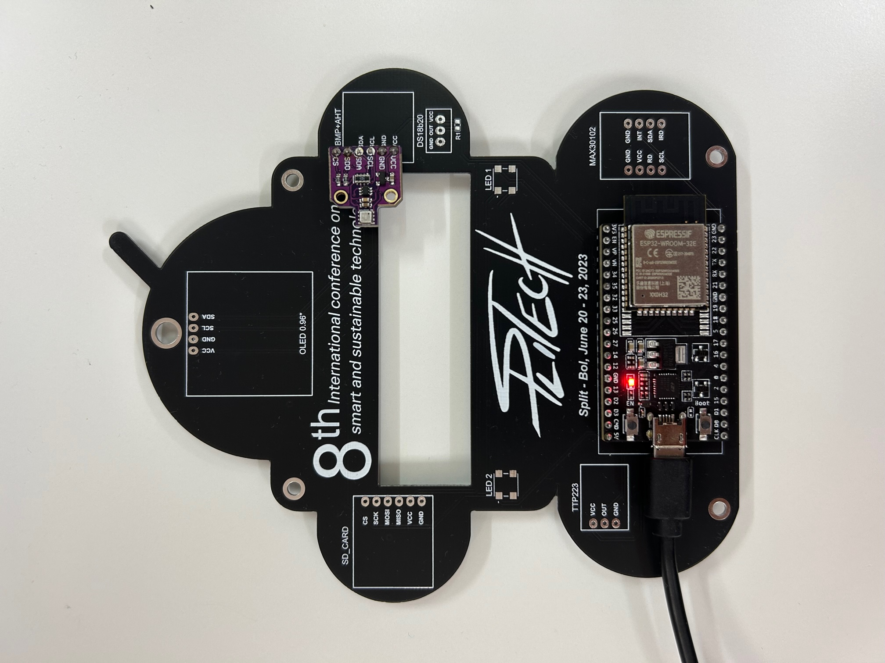
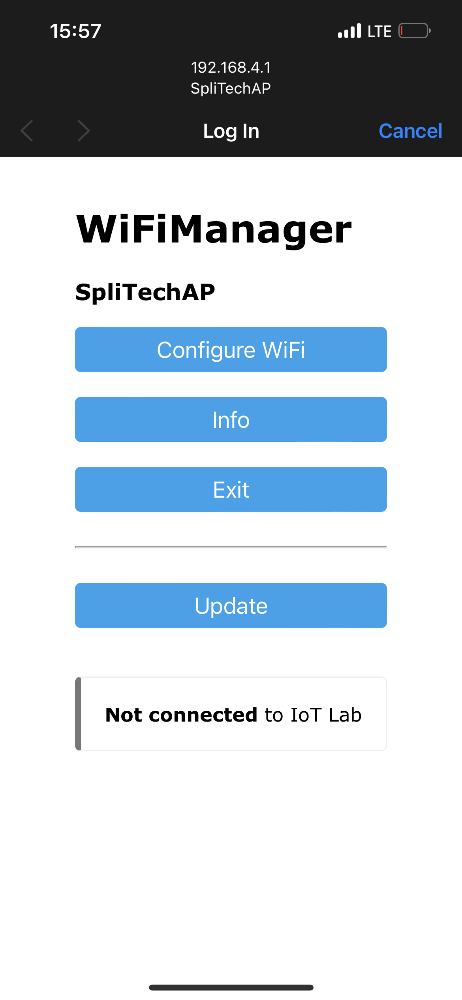
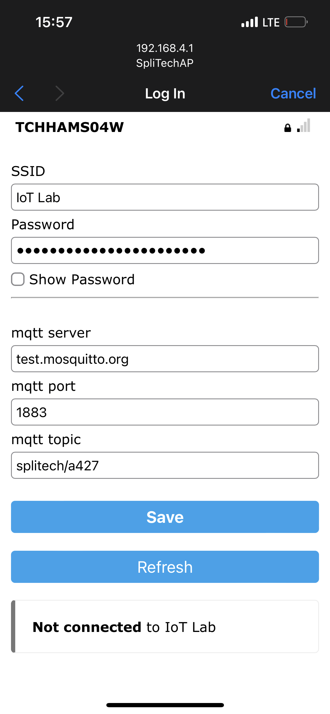
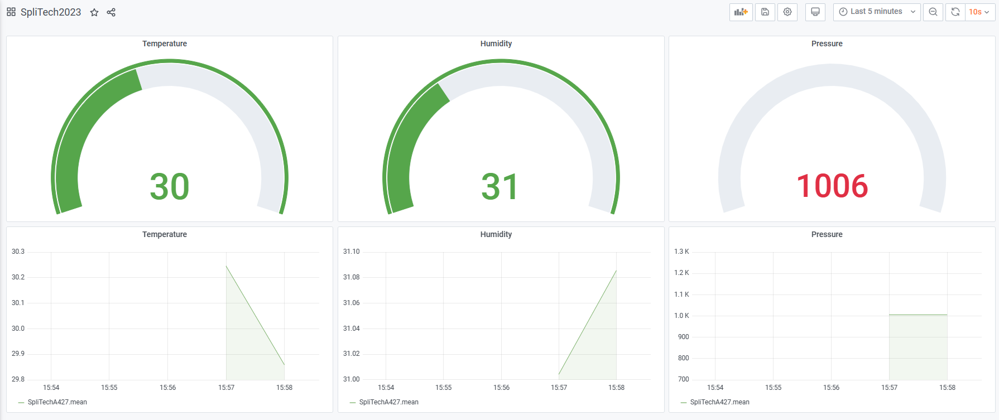

# SpliTech Weather Station

For this project I used SpliTech accreditation as an inspiration to create a Weather station. Inspired by instructions from [EnergyPulse](https://github.com/EnergyPulse/SpliTech2023), I took one step further to see whan also can be done.

As can be seen in picture below, SpliTech accreditation allows us to solder ESP32 Dev board along with a lot of other sensor devices, LEDs, OLED screen, to make a world of your own.

I happen to have an [ESP32 Dev board](https://www.espressif.com/en/products/devkits/esp32-devkitc/overview) and a [BME680](https://randomnerdtutorials.com/esp32-bme680-sensor-arduino/) sensor, which contains temperature, humidity, barometric pressure, and VOC gas sensing capabilities.

Great thing about ESP32 is that it has WiFi capabilities, which allows you to send sensor data everywhere you like over WiFi. Crazy thing about ESP32 is that has a lot of other features such as you can create a hotspot with web configuration portal which gives you a ton of possibilities. The feature/library WiFiManager turns ESP into Access Point mode and spins up a DNS and WebServer. By connecting your phone or tablet ta a newly created ESP Access Point, a Captive Portal appeara which will allow you to select choose one of scanned access points, and enter its password. This will point ESP32 to a WiFi AP you want, allowing you to send data into the cloud.

As you can see, we created a SpliTechAP hotspot, which scans for the available APs and connects to one you choose - IoT Lab was in our case the best one. We also added a feature where we you can enter MQTT server, port and topic to send sensor data to a broker of your own with a topic you select. After saving all, you can see the magic appeared in our Grafana browser.

The complete code is given in [code folder](code). Sensor data is sent every 10 seconds using [Simple Timer](https://github.com/jfturcot/SimpleTimer), while all parameters are saved in ESP32 filesystem using Serial Peripheral Interface Flash File System ([SPIFFS](https://randomnerdtutorials.com/install-esp32-filesystem-uploader-arduino-ide/)).

Some useful links below:

[1] [Simple Timer](https://github.com/jfturcot/SimpleTimer)  
[2] [WiFiManager](https://github.com/tzapu/WiFiManager)  
[3] [MQTT Doorbell](https://github.com/thehookup/Wireless_MQTT_Doorbell/blob/master/Doorbell_CONFIGURE.ino)  
[4] [Install ESP32 Filesystem Uploader in Arduino IDE](https://randomnerdtutorials.com/install-esp32-filesystem-uploader-arduino-ide/)